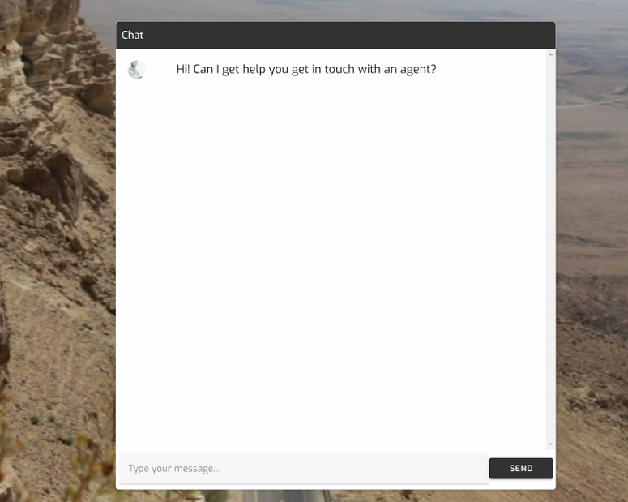
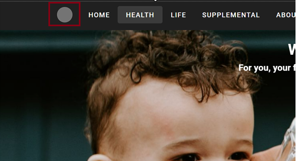

# Single Page Vuetify App


## Overview

This is a simple single page Vutetify app with integrated chat designed to interact with APIs provided by [OpenBrain](https://www.github.com/svange/openbrain). This project aims to offer a serverless, fast, configurable chat UI that can be used across various domains and applications.

### Find the deployed UIs at the following URLs:
Due to lambda cold starts, please allow for up to 10 seconds for the chat to start.

Example style website (copy this): https://woxomhealth.com/

#### Woxom

- Production stage: https://www.woxomai.com

## Initial Requirements

### Functional Requirements

I am rewriting our site using Vuetify and integrating a chat bot. Our current page can be found at [https://www.openbra.in/](https://www.woxomhealth.com/).

This repo contains some scaffolding of the rebuild. It’s a project using npm/vite/vue/vuetify. To see the current state of the project, run the following command:

```bash
npm run dev
```

The chat bot on the bottom right does not work, but I will provide code from another project to make this work. Working chat bot code can be seen in action at [https://www.openbra.in/](https://dev-www.woxomai.com/).

Just provide a fake email address, it’s just a proof of concept. Be aware that the bot takes about 10 seconds to get the initial response (this is a lambda cold start).

[README.md](README.md)
Methods that make this work are found in `./src/components/ChatBot.bue`, and they will need to be bound to elements in the new pop-up chat dialog.

## Additional Requirements

1. Going to the website with no path in the URI (`https://localhost:3000`) should display the home page. Currently, the home page must be selected.
2. Create and add a simple logo.


3. Copy the Home, Health Life, Supplemental, and About pages from the example website.
4. Integrate chat code with the chat widget.
5. Style the chat widget better than it is currently styled.
6. Send the first request for a new chat conversation upon page load (to hide the cold start delay).
7. Keep the chat button visibly disabled until the first message arrives. Once the first message comes in, enable the chat button.


8. Remove footer bar.
9. Remove the search bar.

## Using the OpenBrain API

Detailed below are examples of how to use the OpenBrain API for initiating chat sessions and customizing agent configurations. Session ID is stored in a cookie on the browser and origin policy applies. API key is needed.

## ChatMessage Object
### Fields:
- **clientId**: Used to identify the user client. The client is the user that deploys the chat widget with their API key. Used for tracking, not authentication. Each Client owns a set of AgentConfigs and can use them to start chat sessions. The "public" `client_id` is available to all clients.
- **message**: The message sent by the user. Only considered during requests to chat (`reset == False`).
- **reset**:
    - If `True`, the session is reset and an optional AgentConfig is used to start a new session. A default is used if no AgentConfig is provided. A `Session` cookie is set and the `sessionId` is returned with the response.
    - If `False`, the chat session is continued and a response to **message** is returned. A `Session` cookie is required to continue a session.
- **agentConfig**: The name (`profile_name`) of the AgentConfig to use. If used in conjuction with `agentConfigOverrides`, uses the named AgentConfig as a base, and overlays fields in the base with fields in the override object. Only considered during requests to reset (`reset == True`).

## ChatMessage Examples
1. Begin a session with the default AgentConfig owned by the `public` client.
    ```json 
    {
        "clientId": "public",
        "agentConfig": "default",
        "reset": "True"
    }
    ```

1. Chat with your currently active session.
    ```json 
    {
        "message": "What's the velocity of an unladen swallow?"
    }
    ``` 

1. Use a saved AgentConfig to start a new session.

    ```json 
    {
      "clientId": "my_clientId",
      "agentConfig": "my_agentConfig_profile",
      "reset": "True"
    }
    ```

## Project Setup

### Development Environment Configuration

Environment-specific settings are managed through environment variables defined in the file `.env`, see `.env.example` for a starting point. Copy this file to `./.env`, and fill out missing values to use these values.
